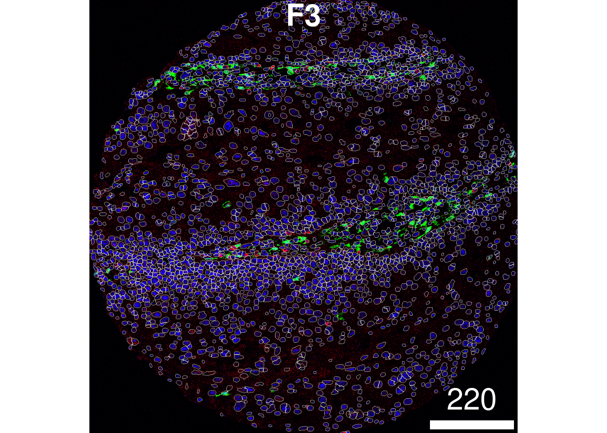

```{r, echo = FALSE}
knitr::knit_hooks$set(time_it = local({
  now <- NULL
  function(before, options) {
    if (before) {
      # record the current time before each chunk
      now <<- Sys.time()
    } else {
      # calculate the time difference after a chunk
      res <- difftime(Sys.time(), now, units = "secs")
      # return a character string to show the time
      paste("Time for this code chunk to run:", round(res,
        2), "seconds")
    }
  }
}))
```

```{r, include = FALSE}
knitr::opts_chunk$set(
  #collapse = TRUE,
  #eval = FALSE,
  comment = "#>",
  cache = FALSE,
  message = FALSE,
  warning = FALSE
)
```

```{=html}
<style>
.question {
  padding: 1em;
  background: lightcyan;
  color: black;
  border-radius: 10px;
}
</style>
```
**Presenting Authors**

Farhan Ameen$^{1,2,3}$, Alex Qin$^{1,2,3}$, Shreya Rao$^{1,2,3}$, Ellis
Patrick$^{1,2,3}$.

$^1$ Westmead Institute for Medical Research, University of Sydney,
Australia\
$^2$ Sydney Precision Data Science Centre, University of Sydney,
Australia\
$^3$ School of Mathematics and Statistics, University of Sydney,
Australia

<br/> Contact: ellis.patrick\@sydney.edu.au

## Overview

Understanding the interplay between different types of cells and their
immediate environment is critical for understanding the mechanisms of
cells themselves and their function in the context of human diseases.
Recent advances in high dimensional in situ cytometry technologies have
fundamentally revolutionized our ability to observe these complex
cellular relationships providing an unprecedented characterisation of
cellular heterogeneity in a tissue environment.

### Description

In this workshop we will introduce some of the key analytical concepts
needed to analyse data from high dimensional spatial omics technologies
such as, PhenoCycler, IMC, Xenium and MERFISH. We will show how
functionality from our Bioconductor packages simpleSeg, FuseSOM,
scClassify, scHot, spicyR, listClust, statial, scFeatures and ClassifyR
can be used to address various biological hypotheses. By the end of this
workshop attendees will be able to implement and assess some of the key
steps of a spatial analysis pipeline including cell segmentation,
feature normalisation, cell type identification, microenvironment and
cell-state characterisation, spatial hypothesis testing and patient
classification. Understanding these key steps will provide attendees
with the core skills needed to interrogate the comprehensive spatial
information generated by these exciting new technologies.

### Pre-requisites

It is expected that students will have:

-   basic knowledge of R syntax,
-   this workshop will not provide an in-depth description of
    cell-resolution spatial omics technologies.

### *R* / *Bioconductor* packages used

Several single cell R packages will be used from the scdney package, for
more information visit: <https://sydneybiox.github.io/scdney/>.

### Learning objectives

-   Understand and visualise spatial omics datasets.
-   Identify key biological questions that can be addressed with these
    technologies and spatial analysis.
-   Understand the key analytical steps involved in spatial omics
    analysis, and perform these steps using R.
-   Evaluate the performance of data normalisation and cell
    segmentation.
-   Understand and generate individual feature representations from
    spatial omics data.
-   Develop appreciation on how to assess performance of classification
    models.
-   Perform disease outcome prediction using the feature representation
    and robust classification framework.

# Context

In the following we will re-analyse some IMC data [(Ferguson et al,
2022)](https://doi.org/10.1158/1078-0432.CCR-22-1332) profiling the
spatial landscape of head and neck cutaneous squamous cell carcinomas
(HNcSCC), the second most common type of skin cancer. The majority of
HNcSCC can be treated with surgery and good local control, but a subset
of large tumours infiltrate subcutaneous tissue and are considered high
risk for local recurrence and metastases. The key conclusion of this
manuscript (amongst others) is that spatial information about cells and
the immune environment can be used to predict primary tumour progression
or metastases in patients. We will use our spicy workflow to reach a
similar conclusion.


# Setup

## Installation

```{r install, warning=FALSE, message=FALSE, eval = FALSE}
if (!requireNamespace("BiocManager", quietly = TRUE)) {
    install.packages("BiocManager")
}

BiocManager::install(c( "simpleSeg", "cytomapper", "scClassify", "scHOT", "FuseSOM","glmnet", "spicyR", "lisaClust","Statial", "scFeatures", "ClassifyR", "tidyverse", "scater", "SingleCellExperiment", "STexampleData", "SpatialDatasets", "tidySingleCellExperiment", "scuttle", "batchelor"))
```

## Load packages

```{r library, warning=FALSE, message=FALSE}

# packages from scdney
library(scdneySpatialBiocAsia2024)
library(SpatialDatasets)
library(simpleSeg)
library(FuseSOM)
library(lisaClust)
library(spicyR)
library(Statial)
library(ClassifyR)

# Other required packages
library(tidySingleCellExperiment)
library(tidyverse)
library(SingleCellExperiment)
library(cytomapper)
library(scater)
library(glmnet)
library(knitr)

theme_set(theme_classic())

nCores <- 8  # Feel free to parallelise things if you have the cores to spare.
BPPARAM <- simpleSeg:::generateBPParam(nCores)
source(system.file("extdata", "utils.R", package = "scdneySpatialBiocAsia2024"))
options("restore_SingleCellExperiment_show" = TRUE)

```

## Download images

Feel free to follow along for this section. Much of the segmentation
pipeline is computationally demanding, and most likely won't be able to
run on the Bioconductor Galaxy servers.

```{r read-images, eval = FALSE}
# Reads images to cache in a directory specified by the pathToImages variable.
pathToImages <- SpatialDatasets::Ferguson_Images()
tmp <- tempfile() # Creates a temporary directory.
unzip(pathToImages, exdir = tmp) # Unzips files to the temporary directory.

# Store images in a CytoImageList on_disk as h5 files to save memory.
images <- cytomapper::loadImages(
  tmp, # Read files from the temporary directory.
  single_channel = TRUE,
  on_disk = TRUE,
  h5FilesPath = HDF5Array::getHDF5DumpDir(),
  BPPARAM = BPPARAM
)

mcols(images) <- S4Vectors::DataFrame(imageID = names(images))
```

```{r clean-channel-names, eval = FALSE}
# Clean channel names
cn <- channelNames(images) # Read in channel names
head(cn)

cn <- sub(".*_", "", cn) # Remove preceding letters
cn <- sub(".ome", "", cn) # Remove the .ome
head(cn)

channelNames(images) <- cn # Reassign channel names

```

```{r clean-image-names, eval = FALSE}
# Clean image names
head(names(images))

nam <- sapply(strsplit(names(images), "_"), `[`, 3)
head(nam)

names(images) <- nam # Reassigning image names
mcols(images)[["imageID"]] <- nam # Reassigning image names
```

# SimpleSeg: Segmentation

[SimpleSeg
Package](https://www.bioconductor.org/packages/release/bioc/html/simpleSeg.html)

## Run simpleSeg

If your images are stored in a `list` or `CytoImageList` they can be
segmented with a simple call to `simpleSeg()`. To summarise,
`simpleSeg()` is an R implementation of a simple segmentation technique
which traces out the nuclei using a specified channel using `nucleus`
then dilates around the traced nuclei by a specified amount using
`discSize`. The nucleus can be traced out using either one specified
channel, or by using the principal components of all channels most
correlated to the specified nuclear channel by setting `pca = TRUE`.

In the particular example below, we have asked `simpleSeg` to do the
following:

By setting `nucleus = c("HH3")`, we've asked simpleSeg to trace out the
nuclei signal in the images using the HH3 channel. By setting
`pca = TRUE`, simpleSeg segments out the nuclei mask using a principal
component analysis of all channels and using the principal components
most aligned with the nuclei channel, in this case, HH3. By setting
`cellBody = "dilate"`, simpleSeg uses a dilation strategy of
segmentation, expanding out from the nucleus by a specified `discSize`.
By setting `discSize = 3`, simpleSeg dilates out from the nucleus by 3
pixels. By setting `sizeSelection = 20`, simpleSeg ensures that only
cells with a size greater than 20 pixels will be used. By setting
`transform = "sqrt"`, simpleSeg square root transforms each of the
channels prior to segmentation. By setting
`tissue = c("panCK", "CD45", "HH3")`, we specify a tissue mask which
simpleSeg uses, filtering out all background noise outside the tissue
mask. This is important as these are tumour cores, wand hence circular,
so we'd want to ignore background noise which happens outside of the
tumour core.

There are many other parameters that can be specified in simpleSeg
(`smooth`, `watershed`, `tolerance`, and `ext`), and we encourage the
user to select the best parameters which suit their biological context.

```{r simpleseg, eval = FALSE}
masks <- simpleSeg(images,
                   nucleus = c("HH3"),
                   pca = TRUE,
                   cellBody = "dilate",
                   discSize = 3,
                   sizeSelection = 20,
                   transform = "sqrt",
                   tissue = c("panCK", "CD45", "HH3"),
                   cores = nCores
                   )
```

## Visualise outlines

The `plotPixels` function in `cytomapper` makes it easy to overlay the
mask on top of the nucleus intensity marker to see how well our
segmentation process has performed. Here we can see that the
segmentation appears to be performing reasonably.

If you see over or under-segmentation of your images, `discSize` is a
key parameter in `simpleSeg()` for optimising the size of the dilation
disc after segmenting out the nuclei.

```{r see-seg-nuclei, eval = FALSE}
plotPixels(image = images["F3"], 
           mask = masks["F3"],
           img_id = "imageID", 
           colour_by = c("HH3"), 
           display = "single",
           colour = list(HH3 = c("black","blue")),
           legend = NULL,
           bcg = list(
             HH3 = c(1, 1, 2)
           ))
```


If you wish to visualise multiple markers instead of just the HH3 marker
and see how the segmentation mask performs, this can also be done. Here,
we can see that our segmentation mask has done a good job of capturing
the CD31 signal, but perhaps not such a good job of capturing the FXIIIA
signal, which often lies outside of our dilated nuclear mask. This could
suggest that we might need to increase the `discSize` of our dilation.

```{r see-seg-markers, eval = FALSE}
plotPixels(image = images["F3"], 
           mask = masks["F3"],
           img_id = "imageID", 
           colour_by = c("HH3", "CD31", "FX111A"), 
           display = "single",
           colour = list(HH3 = c("black","blue"),
                         CD31 = c("black", "red"),
                         FX111A = c("black", "green") ),
           legend = NULL,
           bcg = list(
             HH3 = c(1, 1, 2),
             CD31 = c(0, 1, 2),
             FX111A = c(0, 1, 1.5)
           ))
```



::: question
**Questions**

1.  Is there any information we're not capturing with this segmentation?
2.  What parameters might you change to improve the segmentation?
3.  What are some intrinsic limitations of the simpleSeg method?
:::


In order to characterise the phenotypes of each of the segmented cells,
`measureObjects()` from `cytomapper` will calculate the average
intensity of each channel within each cell as well as a few
morphological features. By default, the `measureObjects()` function will
return a `SingleCellExperiment` object, where the channel intensities
are stored in the `counts` assay and the spatial location of each cell
is stored in `colData` in the `m.cx` and `m.cy` columns.

However, you can also specify `measureObjects()` to return a
`SpatialExperiment` object by specifying `return_as = "spe"`. As a
`SpatialExperiment` object, the spatial location of each cell is stored
in the `spatialCoords` slot, as `m.cx` and `m.cy`, which simplifies
plotting. In this demonstration, we will return a `SpatialExperiment`
object.

```{r measureobjects, eval = FALSE}
# Summarise the expression of each marker in each cell
cells <- cytomapper::measureObjects(masks,
                                    images,
                                    img_id = "imageID",
                                    return_as = "spe",
                                    BPPARAM = BPPARAM)

spatialCoordsNames(cells) <- c("x", "y")
```

Next, to associate features in our image with disease progression, it is
important to read in information which links image identifiers to their
progression status. We will do this here, making sure that our `imageID`
column matches.

```{r clinical, eval = FALSE}
clinical <- read.csv(
  system.file(
    "extdata/clinicalData_TMA1_2021_AF.csv",
    package = "scdneySpatialBiocAsia2024"
  )
)

rownames(clinical) <- clinical$imageID
clinical <- clinical[names(images), ]

colData(cells) <- cbind(colData(cells), clinical[cells$imageID, ])
```

# simpleSeg: Normalisation

We've made it easy to follow on from the normalisation section. Our
`SpatialDatasets` package has the segmented SCE file stored in the
function `spe_Ferguson_2022()`.

```{r load-spe, time_it = TRUE}
#Download data now
cells = SpatialDatasets::spe_Ferguson_2022()

cells$x = spatialCoords(cells)[, "x"]
cells$y = spatialCoords(cells)[, "y"]
```

## Normalise the data

We should check to see if the marker intensities of each cell require
some form of transformation or normalisation. The reason we do this is
two-fold:\
1) The intensities of images are often highly skewed, preventing any
meaningful downstream analysis.\
2) The intensities across different images are often different, meaning
that what is considered "positive" can be different across images.

By transforming and normalising the data, we aim to reduce these two
effects. Here we extract the intensities from the `counts` assay.
Looking at CD3 which should be expressed in the majority of the T cells,
the intensities are clearly very skewed, and it is difficult to see what
is considered a CD3- cell, and what is a CD3+ cell.

```{r cd3-density, fig.width=5, fig.height=5}
# Plot densities of CD3 for each image.
cells |> 
  join_features(features = rownames(cells), shape = "wide", assay = "counts") |> 
  ggplot(aes(x = CD3, colour = imageID)) + 
  geom_density() + 
  theme(legend.position = "none")
```

::: question
**Questions**

Can we see what is a CD3+ vs a CD3- cell here?
:::

## Dimension reduction and visualisation

As our data is stored in a `SpatialExperiment` we can also use `scater`
to perform and visualise our data in a lower dimension to look for batch
effects in our images. We can see that before normalisation, our UMAP
shows a clear batch effect between images.

```{r umap, time_it = TRUE}
# Usually we specify a subset of the original markers which are informative to separating out distinct cell types for the UMAP and clustering.
ct_markers <- c("podoplanin", "CD13", "CD31",
                "panCK", "CD3", "CD4", "CD8a",
                "CD20", "CD68", "CD16", "CD14", "HLADR", "CD66a")

set.seed(51773)
# Perform dimension reduction using UMAP.
cells <- scater::runUMAP(
  cells,
  subset_row = ct_markers,
  exprs_values = "counts"
)

# Select a subset of images to plot.
someImages <- unique(cells$imageID)[c(1, 5, 10, 20, 30, 40)]

# UMAP by imageID.
scater::plotReducedDim(
  cells[, cells$imageID %in% someImages],
  dimred = "UMAP",
  colour_by = "imageID"
)
```

We can transform and normalise our data using the `normalizeCells`
function. In the `normalizeCells()` function, we specify the following
parameters. `transformation` is an optional argument which specifies the
function to be applied to the data. We do not apply an arcsinh
transformation here, as we already apply a square root transform in the
`simpleSeg()` function. `method = c("trim99", "mean", PC1")` is an
optional argument which specifies the normalisation method/s to be
performed. Here, we: 1) Trim the 99th percentile 2) Divide by the mean
3) Remove the 1st principal component `assayIn = "counts"` is a required
argument which specifies what the assay you'll be taking the intensity
data from is named. In our context, this is called `counts`.

This modified data is then stored in the `norm` assay by default. We can
see that this normalised data appears more bimodal, not perfectly, but
likely to a sufficient degree for clustering, as we can at least observe
a clear CD3+ peak at 1.00, and a CD3- peak at around 0.3.

```{r normalisation, fig.width=8, fig.height=5, time_it = TRUE}
# Leave out the nuclei markers from our normalisation process. 
useMarkers <- rownames(cells)[!rownames(cells) %in% c("DNA1", "DNA2", "HH3")]

# Transform and normalise the marker expression of each cell type.
cells <- simpleSeg::normalizeCells(cells,
                        markers = useMarkers,
                        transformation = NULL,
                        method = c("trim99", "mean", "PC1"),
                        assayIn = "counts",
                        cores = nCores
)

# Plot densities of CD3 for each image
cells |> 
  join_features(features = rownames(cells), shape = "wide", assay = "norm") |> 
  ggplot(aes(x = CD3, colour = imageID)) + 
  geom_density() + 
  theme(legend.position = "none")
```

::: question
**Questions**

Can we see what is a CD3+ vs a CD3- cell here?

:::


```{r norm-umap, time_it = TRUE}
set.seed(51773)
# Perform dimension reduction using UMAP.
cells <- scater::runUMAP(
  cells,
  subset_row = ct_markers,
  exprs_values = "norm",
  name = "normUMAP"
)

someImages <- unique(cells$imageID)[c(1, 5, 10, 20, 30, 40)]

# UMAP by imageID.
scater::plotReducedDim(
  cells[, cells$imageID %in% someImages],
  dimred = "normUMAP",
  colour_by = "imageID"
)
```

::: question
**Questions**

1.  What are we hoping to achieve with normalisation?
2.  What has changed between the pre-normalisation and
    post-normalisation correction UMAP?
:::


# FuseSOM

[FuseSOM
Package](https://www.bioconductor.org/packages/release/bioc/html/FuseSOM.html)
[FuseSOM Article](https://doi.org/10.1093/bioadv/vbad141)

To dissect more information about cell interactions with each other, and
cell-specific differences between groups, we next perform clustering.
The `runFuseSOM()` function from the `FuseSOM` package conveniently runs
clustering on any `SingleCellExperiment` object, by specifying the
number of clusters under `numClusters`.

```{r FuseSOM, time_it = TRUE}
# Set seed.
set.seed(51773)

# Generate SOM and cluster cells into 10 groups
cells <- runFuseSOM(
  cells,
  markers = ct_markers,
  assay = "norm",
  numClusters = 10
)

```

We can also observe how reasonable our choice of `k = 10` was, using the
`estimateNumCluster()` and `optiPlot()` functions. Here we examine the
Gap method, but others such as Silhouette and Within Cluster Distance
are also available. We can see that there are elbow points in the gap
statistic at `k = 7`, `k = 10`, and `k = 11`. We've specified `k = 10`,
striking a good balance between the number of clusters and the gap
statistic.

```{r numcluster}
cells <- estimateNumCluster(cells, kSeq = 2:30)
optiPlot(cells, method = "gap")
```

::: question
**Questions**

1.  Was our choice of `k = 10` a good choice?
2.  What other `k` might have made sense?
3.  From a biological perspective, what would increasing `k` do?
:::

## Attempt to interpret the phenotype of each cluster

We can begin the process of understanding what each of these cell
clusters are by using the `plotGroupedHeatmap` function from `scater`.
At the least, here we can see we capture all the major immune
populations that we expect to see, including the CD4 and CD8 T cells,
the CD20+ B cells, the CD68+ myeloid populations, the CD66+
granulocytes, the podoplanin+ epithelial cells, and the panCK+ tumour
cells.

```{r cluster-heatmap}
# Visualise marker expression in each cluster.
scater::plotGroupedHeatmap(
  cells,
  features = ct_markers,
  group = "clusters",
  exprs_values = "norm",
  center = TRUE,
  scale = TRUE,
  zlim = c(-3, 3),
  cluster_rows = FALSE,
  block = "clusters"
)
```

Given domain-specific knowledge of the tumour-immune landscape, we can
go ahead and annotate these clusters as cell types given their
expression profiles.

```{r annotate-cells}
cells <- cells |>
  mutate(cellType = case_when(
    clusters == "cluster_1" ~ "GC", # Granulocytes
    clusters == "cluster_2" ~ "MC", # Myeloid cells
    clusters == "cluster_3" ~ "SC", # Squamous cells
    clusters == "cluster_4" ~ "EP", # Epithelial cells
    clusters == "cluster_5" ~ "SC", # Squamous cells
    clusters == "cluster_6" ~ "TC_CD4", # CD4 T cells
    clusters == "cluster_7" ~ "BC", # B cells
    clusters == "cluster_8" ~ "EC", # Endothelial cells
    clusters == "cluster_9" ~ "TC_CD8", # CD8 T cells
    clusters == "cluster_10" ~ "DC" # Dendritic cells
  ))
```

We might also be interested in how these cell types are distributed on
the images themselves. Here we examine the distribution of clusters on
image F3, noting the healthy epithelial and endothelial structures
surrounded by tumour cells.

```{r visualise-imageF3}
reducedDim(cells, "spatialCoords") <- spatialCoords(cells)

cells |> 
  filter(imageID == "F3") |> 
  plotReducedDim("spatialCoords", colour_by = "cellType")

```

We find it always useful to check the number of cells in each cluster.

```{r cellnumbers}
# Check cell type frequencies.
cells$cellType |>
  table() |>
  sort()
```

::: question
**Questions**

1.  Does our distribution of cell types make sense?
2.  What would we normally expect as the most expressed cell type and
    the least expressed cell type for this dataset?
:::


We can also use the UMAP we computed earlier to visualise our data in a
lower dimension and see how well our annotated cell types cluster out.

```{r umap-celltype}
# UMAP by cell type
scater::plotReducedDim(
  cells[, cells$imageID %in% someImages],
  dimred = "normUMAP",
  colour_by = "cellType"
)
```

# spicyR: Test spatial relationships

[spicyR
Package](https://www.bioconductor.org/packages/release/bioc/html/spicyR.html)
[spicyR paper](https://doi.org/10.1093/bioinformatics/btac268)

spicyR uses the L-function to determine localisation or dispersion
between cell types. The L-function measures attraction or dispersion
between cell types, with larger values (\> 0) suggesting increased
attraction, and lower values (\< 0) suggesting avoidance between cell
types. We specify a range of radii to calculate the L-function over and
set `sigma = 50` to account for tissue inhomogeneity.

```{r spicy, eval = FALSE}
spicyTest <- spicy(cells,
                  condition = "group",
                  cellTypeCol = "cellType",
                  imageIDCol = "imageID",
                  Rs = 1:10*10,
                  sigma = 50,
                  BPPARAM = BPPARAM)
```

::: question
**Questions**

1.  What does an L-function value of 0 suggest?
2.  How would you choose the optimal radii (`Rs`) for a given dataset?
:::


To save time we have saved the output of the above code.

```{r topPairs spicy}
load(system.file("extdata", "spicyTest.rda", package = "scdneySpatialBiocAsia2024"))
topPairs(spicyTest, n = 10)
```

We can visualise these tests using the `signifPlot` function.

```{r signifPlot}
# Visualise which relationships are changing the most.
signifPlot(spicyTest)
```

::: question
**Questions** 1. Which cell types appear to have significant
co-localistion/dispersion? 2. Does this align with what we might expect
to see in a biological context?
:::


`spicyR` also has functionality for plotting out individual pairwise
relationships.

```{r spicyBoxPlot}
spicyBoxPlot(spicyTest, 
             from = "BC", 
             to = "EC")
```

Alternatively, we can look at the most differentially localised
relationship between progressors and non-progressors by specifying
`rank = 1`.

```{r spicyBoxPlot with rank}
spicyBoxPlot(spicyTest, 
             rank = 1)
```

# lisaClust: Find cellular neighbourhoods

[lisaClust
Package](https://www.bioconductor.org/packages/release/bioc/html/lisaClust.html)
[lisaClust paper](https://doi.org/10.1002/cyto.a.24729)

`lisaClust` allows us to identify regions where spatial associations
between cell types is similar. Here we use the `lisaClust` function to
clusters cells into 5 regions with distinct spatial ordering.

```{r lisaClust, time_it = TRUE}
set.seed(51773)

cells <- lisaClust(
  cells,
  k = 4,
  sigma = 50,
  cellType = "cellType",
  BPPARAM = BPPARAM
)

```

To save time the results of the above code have been saved and can be
loaded in.

## Region - cell type enrichment heatmap

We can interpret which spatial orderings the regions are quantifying
using the `regionMap` function. This plots the frequency of each cell
type in a region relative to what you would expect by chance.

```{r regionMap}
# Visualise the enrichment of each cell type in each region
regionMap(cells, cellType = "cellType", limit = c(0.2, 2))
```

## Visualise regions

By default, these identified regions are stored in the `regions` column
in the `colData` of our `SpatialExperiment` object. We can quickly
examine the spatial arrangement of these regions using `ggplot` on image
F3.

```{r plotReducedDim, message=FALSE, warning=FALSE}
cells |> 
  filter(imageID == "F3") |> 
  plotReducedDim("spatialCoords", colour_by = "region")
```

While much slower, the `hatchingPlot` function can also be used to view
regions of co-localisation simultaneously with the cell type calls.

```{r hatchingPlot, time_it = TRUE}
# Use hatching to visualise regions and cell types.
hatchingPlot(
  cells,
  useImages = "F3",
  cellType = "cellType",
  nbp = 300
)
```

::: question
**Questions**

1.  How could the choice of `k` affect our clustering results?
2.  Looking at the graph above, would a different value of `k` be better?
:::


## Test for association with progression

We can use the `colTest` function to test for associations between the
proportions of cells in each region and progression status.

```{r, time_it = TRUE}
# Test if the proportion of each region is associated
# with progression status.
testRegion <- colTest(
  cells,
  feature = "region",
  condition = "group",
  type = "ttest")

testRegion
```

::: question
**Questions**

How could results from `lisaClust` be used in conjunction with results from `spicyR`?
:::


# Statial

[Statial
Package](https://www.bioconductor.org/packages/release/bioc/html/Statial.html)

## SpatioMark: Continuous changes in marker expression associated with varying levels of localisation.

The first step in analysing these changes is to calculate the spatial
proximity (`getDistances`) of each cell to every cell type. These values
will then be stored in the `reducedDims` slot of the
`SingleCellExperiment` object under the names distances. SpatioMark also
provides functionality to look into proximal cell abundance using the
`getAbundance()` function, which is further explored within the
`Statial` package vignette

```{r getDistances, time_it = TRUE}
cells <- getDistances(cells,
  maxDist = 200,
  nCores = nCores,
  cellType = "cellType",
  spatialCoords = c("x", "y")
)
```

We can then visualise an example image, specified with `image = "F3"`
and a particular marker interaction with cell type localisation. To
visualise these changes, we specify two cell types with the `from` and
`to` parameters, and a marker with the `marker` parameter
(cell-cell-marker interactions). Here, we specify the changes in the
marker podoplanin in `SC` as its localisation to `EP` increases or
decreases, where we can observe that podoplanin decreases as its
distance to the dense clump of tumour cells increases.

```{r plotStateChange}
p <- plotStateChanges(
  cells = cells,
  cellType = "cellType",
  spatialCoords = c("x", "y"),
  type = "distances",
  image = "F3",
  from = "SC",
  to = "EP",
  marker = "podoplanin",
  size = 1,
  shape = 19,
  interactive = FALSE,
  plotModelFit = FALSE,
  method = "lm"
)

p
```

SpatioMark aims to holistically uncover all such significant
relationships by looking at all interactions across all images. The
`calcStateChanges()` function provided by Statial can be expanded for
this exact purpose - by not specifying cell types, a marker, or an
image, `calcStateChanges()` will examine the most significant
correlations between distance and marker expression across the entire
dataset.

```{r stateChanges, time_it = TRUE}
state_dist <- calcStateChanges(
  cells = cells,
  cellType = "cellType",
  type = "distances",
  assay = 2,
  nCores = nCores,
  minCells = 100
)

head(state_dist[state_dist$imageID == "F3",], n = 10)
```

The results from our SpatioMark outputs can be converted from a
`data.frame` to a `matrix`, using the `prepMatrix()` function. Note, the
choice of extracting either the t-statistic or the coefficient of the
linear regression can be specified using the `column = "tval"`
parameter, with the coefficient being the default extracted parameter.
We can see that with SpatioMark, we get some features which are
significant after adjusting for FDR.

```{r spatioMarkOutcome, time_it = TRUE}
# Preparing outcome vector
outcome <- cells$group[!duplicated(cells$imageID)]
names(outcome) <- cells$imageID[!duplicated(cells$imageID)]

# Preparing features for Statial
distMat <- prepMatrix(state_dist)

distMat <- distMat[names(outcome), ]

# Remove some very small values
distMat <- distMat[, colMeans(abs(distMat) > 0.0001) > .8]

survivalResults <- colTest(distMat, outcome, type = "ttest")

head(survivalResults)
```

## Kontextual

[Pre-print](https://www.biorxiv.org/content/10.1101/2024.09.03.611109v1)

```{r hierarchy, time_it = TRUE}
# Cluster cell type hierarchy
hierarchy <- treekoR::getClusterTree(t(assay(cells, "norm")),
                                     clusters = cells$cellType,
                                     hierarchy_method = "hopach")


parentList = Statial::getParentPhylo(hierarchy)

# Visualise tree
hierarchy$clust_tree |> 
  plot()

# Add parent 4 and 5
parentList$parent_4 = c(parentList$parent_2, parentList$parent_3)
parentList$parent_5 = c(parentList$parent_1, "EC")

all = unique(cells$cellType)

# Create data frame with all pairwise combinations of cells
treeDf = Statial::parentCombinations(all, parentList = parentList)

```

```{r kontextual, eval = FALSE}
kontext = Statial::Kontextual(
  cells = cells,
  cellType = "cellType",
  r = 50,
  parentDf = treeDf,
  cores = nCores
)
```

To save time we have saved the output of the results above.

```{r loadKontextual}
load(system.file("extdata", "kontext.rda", package = "scdneySpatialBiocAsia2024"))
```

We can use the `spicyR::spicy` to test for associations between the
`Kontextual` values and progression status. To do so we use the
`alternateResult` argument.

```{r kontextOutcome, fig.height = 5, fig.width = 10, time_it = TRUE}
# Converting Kontextual result into data matrix
kontextMat <- Statial::prepMatrix(kontext)

# Replace NAs with 0
kontextMat[is.na(kontextMat)] <- 0

# Test association with outcome
kontextOutcome = spicyR::spicy(
  cells = cells,
  alternateResult = kontextMat,
  condition = "group",
  BPPARAM = BPPARAM
)

# Plot results
signifPlot(kontextOutcome)
```

::: question
**Questions**

1.  Compare this plot to the spicyR results previously using
    `signifPlot(spicyTest)`, how do Kontextual results compare to
    spicyR?
2.  What are the interpretation differences between spicyR and
    Kontextual?
3.  Use the `plotKontextual()` function to visualise some relationships
    (example below), is there anything that strikes out to you?
:::


```{r viewingKontextual, time_it = TRUE}
spicyR::signifPlot(spicyTest)

relationship = "TC_CD4__EC__parent_5"
image = "G4"

kontext |> 
  filter(test == relationship)

# Function from inst/extdata/utils.R file
plotKontextual(relationship, imageChoose = image)

```

# ClassifyR: Patient classification

[ClassifyR
Package](https://www.bioconductor.org/packages/release/bioc/html/ClassifyR.html)

[Journal
article](https://academic.oup.com/bioinformatics/article/31/11/1851/2365648?login=false)

Our ClassifyR package formalises a convenient framework for evaluating
classification in R. We provide functionality to easily include four key
modelling stages; Data transformation, feature selection, classifier
training and prediction; into a cross-validation loop. Here we use the
`crossValidate` function to perform 50 repeats of 5-fold
cross-validation to evaluate the performance of a model (`classifier`)
with feature selection (`selectionMethod`) applied to five
quantifications of our IMC data; 1) Cell type proportions 2) Cell type
localisation from `spicyR` 3) Region proportions from `lisaClust` 4)
Cell type localisation in reference to a parent cell type from
`Kontextual` 5) Cell changes in response to proximal changes from
`SpatioMark`

```{r features, time_it = TRUE}
# Create list to store data.frames
data <- list()

# Add proportions of each cell type in each image
data[["Proportions"]] <- getProp(cells, "cellType")

# Add pair-wise associations
spicyMat <- spicyR::bind(spicyTest)
spicyMat[is.na(spicyMat)] <- 0
spicyMat <- spicyMat |>
  select(!condition) |>
  tibble::column_to_rownames("imageID")

data[["SpicyR"]] <- spicyMat


# Add proportions of each region in each image to the list of dataframes.
data[["LisaClust"]] <- getProp(cells, "region")


# Add SpatioMark features
data[["SpatioMark"]] <- distMat

# Add Kontextual features
data[["Kontextual"]] <- kontextMat
```

We have saved the data list and outcomes for convenience.

```{r loadDataMat}
load(system.file("extdata", "data.rda", package = "scdneySpatialBiocAsia2024"))
```

```{r classification, eval = FALSE}
# Set seed
set.seed(51773)

# Perform 5-fold cross-validation with 50 repeats.
cv <- ClassifyR::crossValidate(
  measurements = data,
  outcome = outcome,
  selectionMethod = "t-test",
  classifier = "LASSOGLM",
  nFolds = 5,
  nFeatures = 20,
  nRepeats = 50,
  nCores = nCores
)

```

We have saved the results for convenience.

```{r loadCV}
load(system.file("extdata", "cv.rda", package = "scdneySpatialBiocAsia2024"))
```

## Visualise cross-validated prediction performance

Here we use the `performancePlot` function to assess the AUC from each
repeat of the 5-fold cross-validation.

```{r performancePlot}
performancePlot(
  cv,
  metric = "AUC",
  characteristicsList = list(x = "Assay Name"),
  orderingList = list("Assay Name" = c("Proportions", "SpicyR", "LisaClust", "Kontextual", "SpatioMark"))
)
```

::: question
**Questions**

1.  Run the following chunk of code, what is this plot telling us?
2.  Do different methods perform differently on different samples?
3.  Knowing this, what might we do to improve our model?
:::

```{r sampleMetrics}
samplesMetricMap(cv)

```

The following code chunk demonstrates how we might use information from multiple matrices to perform classification.

```{r multiViewClassification, eval = FALSE}
# DO NOT RUN
multiCV <- ClassifyR::crossValidate(
  measurements = data,
  outcome = outcome,
  selectionMethod = "t-test",
  classifier = "LASSOGLM",
  nFolds = 5,
  nFeatures = 20,
  nRepeats = 50,
  multiViewMethod = "merge",
  nCores = nCores
)

plot = performancePlot(
  multiCV,
  metric = "AUC",
  characteristicsList = list(x = "Assay Name"),
)

```


# Session Information

```{r}
sessionInfo()
```
